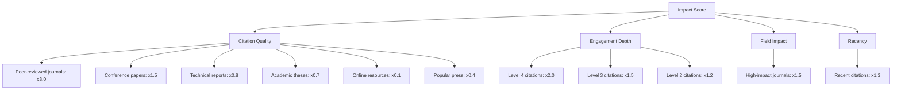

# Getting Started

This guide will help you navigate the Scientific Models Citation Dashboard and make the most of its features.

## Using the Dashboard

The dashboard is designed to provide easy access to citation metrics and visualizations for scientific models. Here's how to use it effectively:

### Main Dashboard

The main dashboard provides an overview of all tracked models, with summary metrics and key visualizations. From here, you can:

- Compare citation counts and impact scores across models
- View trend charts showing citation growth over time
- Access individual model dashboards for deeper analysis

### Model Pages

Each model has its own dedicated dashboard page that includes:

- Detailed citation metrics and trends
- Research domain analysis
- Geographic impact visualization
- Engagement level breakdown
- Future projections

### Citation Analysis

The Citation Analysis page provides tools for exploring raw citation data, allowing you to:

- Search and filter citations by various criteria
- View publication details including authors, journals, and DOIs
- Export citation data for further analysis

## Understanding Metrics

The dashboard uses several key metrics to quantify the impact and reach of scientific models:

### Impact Score

Impact Score is a composite metric that considers various factors:



For detailed information on how the Impact Score is calculated, see the [Impact Metrics documentation](../metrics/impact-metrics).

### Engagement Levels

Citations are categorized into four engagement levels based on how deeply the model is being utilized:

1. **Level 1: Simple Citation** - References the paper without using the model
2. **Level 2: Data Usage** - Uses the model's methodology or data
3. **Level 3: Model Adaptation** - Modifies or extends the model
4. **Level 4: Foundation** - The model is foundational to the research

### Implementation Rate

Implementation Rate measures the percentage of citations that represent active usage of the model (Engagement Levels 2-4), rather than simple references.

## Technical Information

For developers interested in the technical aspects of the dashboard:

### Repository Structure

The dashboard is built as a Docusaurus site with React components for interactive visualizations. The repository structure is as follows:

```
citation-dashboard/
├── blog/                      # Blog posts for updates
├── docs/                      # Documentation content
│   ├── intro.md               # Introduction page
│   ├── getting-started.md     # This guide
│   ├── models/                # Model documentation
│   ├── metrics/               # Metrics documentation
│   ├── visualizations/        # Visualization documentation
│   └── methodology/           # Methodology documentation
├── src/
│   ├── components/            # React components
│   ├── css/                   # CSS files
│   ├── pages/                 # Custom pages
│   └── data/                  # Data files
└── static/                    # Static files
```

### Data Sources

The citation data is collected from multiple sources:

- Google Scholar
- Web of Science
- Scopus
- GitHub repository metrics

### Local Development

To set up the dashboard for local development:

1. Clone the repository:
   ```bash
   git clone https://github.com/scientific-models/citation-dashboard.git
   cd citation-dashboard
   ```

2. Install dependencies:
   ```bash
   npm install
   ```

3. Start the development server:
   ```bash
   npm start
   ```

4. Open your browser to http://localhost:3000

### Contributing

We welcome contributions to improve the dashboard. Please refer to our [contribution guidelines](https://github.com/scientific-models/citation-dashboard/blob/main/CONTRIBUTING.md) for more information.

## Need Help?

If you have questions or need assistance with using the dashboard:

- Check the [FAQ](faq) for answers to common questions
- Report issues on the [GitHub repository](https://github.com/scientific-models/citation-dashboard/issues)
- Contact us at [support@scientific-models-dashboard.org](mailto:support@scientific-models-dashboard.org)