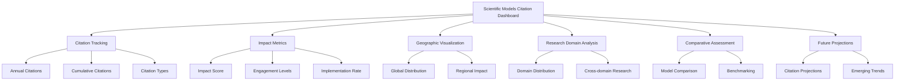

# Introduction

Welcome to the Scientific Models Citation Dashboard documentation. This platform is designed to help researchers, institutions, and funding agencies track the impact and reach of scientific models through comprehensive citation metrics and visualizations.

## What is the Scientific Models Citation Dashboard?

The Scientific Models Citation Dashboard is a web-based platform that visualizes citation data for scientific models across various disciplines. It provides insights into how these models are being used, cited, and extended in research communities worldwide.

The dashboard currently tracks citation metrics for five major scientific models:

- **RAPID** - River Application for Parallel computation of Discharge
- **CMS-Flux** - Carbon Monitoring System Flux
- **ECCO** - Estimating the Circulation and Climate of the Ocean
- **ISSM** - Ice Sheet System Model
- **MOMO-CHEM** - Modern-Era Retrospective analysis for Research and Applications Chemistry

## Why Track Model Citations?

Scientific models represent significant investments in research and development. Tracking their citation metrics helps:

- **Measure Impact**: Understand how widely a model is being used and cited
- **Identify Trends**: Track emerging research directions and applications
- **Justify Funding**: Provide evidence of a model's importance to the scientific community
- **Map Collaborations**: Visualize global usage and identify potential collaboration opportunities
- **Guide Development**: Understand how models are being extended or adapted

## Key Features

### Citation Tracking
Track annual and cumulative citations over time, broken down by publication type, research domain, and more.

### Impact Metrics
View comprehensive impact scores that consider not just citation counts, but also the quality of citations, engagement depth, and field impact.

### Geographic Visualization
Explore where models are being applied globally, with detailed information on specific watersheds, ocean regions, ice sheets, and other geographical areas.

### Research Domain Analysis
Understand how models are being applied across different research domains and disciplines.

### Comparative Assessment
Compare citation metrics and impact scores across different models to benchmark performance.

### Future Projections
View data-driven projections of future citation growth and emerging research directions.

## Getting Started

To begin exploring the dashboard:

1. Visit the [Dashboard](/dashboard) to see an overview of all models
2. Explore individual [Model pages](/models) for detailed metrics
3. Check out the [Citation Analysis](/citations) for in-depth citation data

For developers interested in the technical details or contributing to the project, please refer to our [Getting Started guide](getting-started).

## About the Data

The citation data visualized in this dashboard is collected from multiple sources:

- Google Scholar
- Web of Science
- Scopus
- GitHub repository metrics

Data is updated quarterly, with the most recent update on May 16, 2025. For more information on how the data is collected and processed, see our [Methodology documentation](methodology/data-collection).