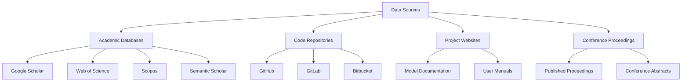
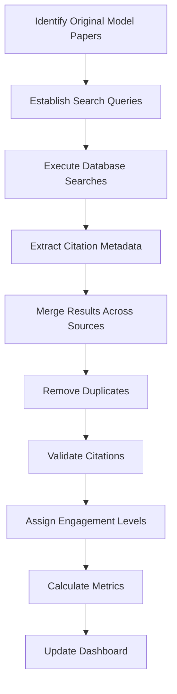

# Data Collection Methodology

This document outlines the methodology used to collect, process, and analyze citation data for scientific models tracked in the dashboard. Our comprehensive approach ensures accurate and consistent metrics across different models and fields.

## Data Sources

We collect citation data from multiple sources to ensure comprehensive coverage:



### Primary Sources

#### Academic Databases

- **Google Scholar**: Provides the broadest coverage of academic literature, including conference papers, theses, and technical reports
- **Web of Science**: Offers high-quality indexed academic publications with detailed metadata
- **Scopus**: Additional academic database with good coverage of certain fields
- **Semantic Scholar**: AI-powered research tool that identifies connections between papers

#### Code Repositories

- **GitHub**: Repository metrics for open-source models
- **GitLab**: Alternative repository platform with similar metrics
- **Bitbucket**: Additional repository platform used by some projects

#### Project Websites

- Official model websites
- Project documentation
- User manuals and guides

#### Conference Proceedings

- Published conference proceedings
- Workshop materials
- Conference abstracts and presentations

## Data Collection Process

Our data collection follows a structured process to ensure consistency and accuracy:



### Step 1: Identify Original Model Papers

We begin by identifying the original papers describing each scientific model. These papers serve as the primary citation sources for tracking the model's impact.

For models with multiple foundational papers, we track citations to all key papers and avoid double-counting when papers are co-cited.

### Step 2: Establish Search Queries

We develop comprehensive search queries for each model, including:

- Exact paper titles
- DOI references
- Model name variations
- Author citations

Example query for RAPID:
```
"River network routing on the NHDPlus dataset" OR 
"RAPID model" OR 
"River Application for Parallel computation of Discharge" OR 
DOI:10.1175/2011JHM1345.1 OR 
(David AND Maidment AND "river routing")
```

### Step 3: Execute Database Searches

Search queries are executed across all data sources on a quarterly basis. For each source, we:

1. Implement source-specific query formats
2. Apply appropriate filters (publication date, language, document type)
3. Retrieve all available citation metadata
4. Document search parameters for reproducibility

### Step 4: Extract Citation Metadata

For each citing document, we extract comprehensive metadata:

- Title
- Authors
- Publication date
- Publication venue (journal, conference, etc.)
- Abstract
- Full text (when available)
- DOI or other identifiers
- Citation count
- Publication type

### Step 5: Merge Results Across Sources

Results from different sources are merged into a unified database:

1. Match records based on DOI, title, and author combinations
2. Retain the most complete metadata when records appear in multiple sources
3. Preserve source attribution for traceability

### Step 6: Remove Duplicates

Duplicate entries are identified and removed based on:

- Exact DOI matches
- Title similarity above 95%
- Author and publication date matches

In cases of uncertainty, entries are manually reviewed to determine if they represent duplicate citations.

### Step 7: Validate Citations

The citation dataset undergoes validation to ensure accuracy:

- Random sampling for manual verification (10% of entries)
- Cross-checking against author-provided citation lists
- Verification of ambiguous or unusual entries
- Confirmation of high-impact citations

### Step 8: Assign Engagement Levels

Each citation is assigned an engagement level based on how the model is used:

1. **Level 1: Simple Citation** - References the paper without using the model
2. **Level 2: Data Usage** - Uses the model's methodology or data
3. **Level 3: Model Adaptation** - Modifies or extends the model
4. **Level 4: Foundation** - The model is foundational to the research

Assignment is performed through a combination of:

- Automated text analysis
- Keyword identification
- Manual review of selected papers
- Machine learning classification (for papers with full text access)

For more details on engagement classification, see the [Citation Analysis Methodology](citation-analysis) page.

### Step 9: Calculate Metrics

Based on the processed citation data, we calculate a comprehensive set of metrics:

- Basic citation counts
- Temporal trends
- Geographic distribution
- Research domain analysis
- Impact scores
- Implementation rates

The calculation methodology for each metric is documented in the respective [Metrics](../metrics/citation-metrics) sections.

### Step 10: Update Dashboard

The dashboard is updated with new data and metrics on a quarterly basis. Each update includes:

- Data update timestamp
- Summary of changes from previous version
- Notification of significant metric changes
- Documentation of any methodological adjustments

## Data Quality Control

We implement several quality control measures to ensure data accuracy:

### Automated Checks

- Duplicate detection algorithms
- Outlier identification
- Completeness verification
- Format validation
- Temporal consistency checks

### Manual Review

- Random sampling of 10% of new entries
- Expert review of engagement level assignments
- Verification of high-impact or unusual citations
- Cross-checking with model authors

### Continuous Improvement

- User feedback mechanisms for flagging issues
- Quarterly methodology review
- Benchmark comparisons with other citation tracking systems
- Regular update of search queries to capture new terminology

## Special Considerations

### Self-Citations

Citations by the original model authors are tracked separately. While included in total counts, they can be filtered out in the dashboard for analyses that focus on external impact.

### Publication Language

While we prioritize English-language publications, we also track citations in other languages when metadata is available. Machine translation is used to assess engagement levels for non-English publications.

### Preprints and Non-Peer-Reviewed Sources

Citations in preprints and non-peer-reviewed sources are tracked but weighted differently in impact calculations. The dashboard allows filtering by publication type.

### Conference Papers Later Published as Journal Articles

When conference papers are later published as journal articles, we track both but avoid double-counting in aggregate metrics by establishing publication relationships.

## Limitations and Challenges

While we strive for comprehensive coverage, several limitations should be acknowledged:

### Coverage Limitations

- Incomplete indexing in academic databases
- Limited access to full text for detailed engagement analysis
- Varying coverage across research domains
- Time lag in database updates

### Technical Challenges

- Name variations and abbreviations
- Cross-language citations
- Citation context interpretation
- Interdisciplinary terminology differences

### Mitigation Strategies

To address these limitations, we:

- Use multiple data sources to improve coverage
- Implement flexible matching algorithms
- Conduct regular manual validation
- Transparently document known limitations
- Continuously refine our methodology

## Data Privacy and Ethics

Our data collection adheres to the following principles:

- We only collect publicly available citation information
- Personal information about authors is limited to what is published
- All data is aggregated for analysis
- Individual citation patterns are not tracked or reported
- Source terms of service are respected

## Future Improvements

We are continuously improving our data collection methodology, including:

- Expanding data sources to include additional academic databases
- Enhancing automated engagement level classification
- Developing more sophisticated domain classification algorithms
- Implementing real-time citation tracking for selected high-impact models
- Integrating altmetrics data sources

For questions about our data collection methodology or to suggest improvements, please [contact us](mailto:data@scientific-models-dashboard.org).