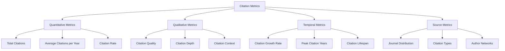
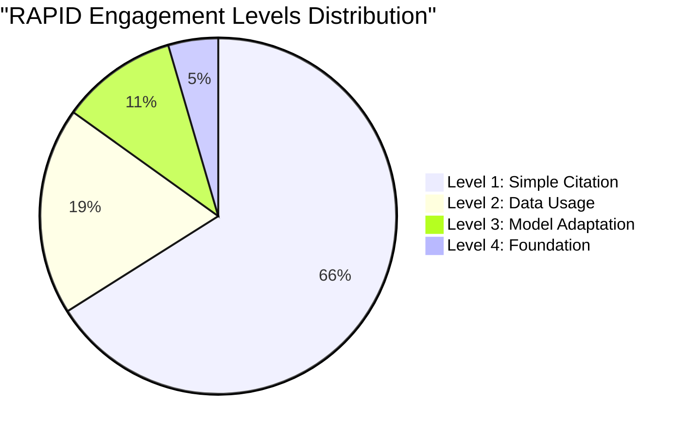

# Citation Metrics

Citation metrics form the foundation of our analysis of scientific model impact. This page explains the various citation metrics tracked by the dashboard and how they are calculated.

## Types of Citation Metrics

The dashboard tracks several types of citation metrics to provide a comprehensive view of a model's impact:



### Quantitative Metrics

These metrics focus on the raw numbers of citations:

#### Total Citations

The cumulative count of all citations to the original model paper and key extension papers. This is the most basic measure of impact but provides limited insight into how the model is actually being used.

:::info
As of May 2025, RAPID has accumulated 265 total citations since its publication in 2011.
:::

#### Average Citations per Year

The total citations divided by the number of years since publication. This metric helps normalize citation counts for models of different ages.

```
$$\text{Average Citations per Year} = \frac{\text{Total Citations}}{\text{Years Since Publication}}$$
```

#### Citation Rate

The rate at which new citations are accumulated, typically measured as citations per month or quarter. This can reveal acceleration or deceleration in a model's adoption.

### Qualitative Metrics

These metrics assess the nature and quality of citations:

#### Citation Quality

Not all citations are equal in terms of impact. Citations are weighted based on the type of publication:

| Publication Type | Weight | Rationale |
|-----------------|--------|-----------|
| Peer-reviewed journals | 3.0 | Highest academic rigor and impact |
| Conference papers | 1.5 | Peer-reviewed but typically less rigorous |
| Technical reports | 0.8 | Official documentation but limited peer review |
| Academic theses | 0.7 | Detailed work but variable in quality |
| Online resources | 0.1 | Minimal academic vetting |
| Popular press | 0.4 | Indicates public interest but not academic impact |

#### Citation Depth (Engagement Levels)

Citations are categorized into four engagement levels based on how deeply the model is being utilized:

1. **Level 1: Simple Citation** - References the paper without using the model
2. **Level 2: Data Usage** - Uses the model's methodology or data
3. **Level 3: Model Adaptation** - Modifies or extends the model
4. **Level 4: Foundation** - The model is foundational to the research



#### Citation Context

The context in which a model is cited provides additional insight into its impact. Context categories include:

- Methodology reference
- Comparison benchmark
- Foundation for extension
- Case study application
- Critical analysis

### Temporal Metrics

These metrics track how citation patterns evolve over time:

#### Citation Growth Rate

The percentage change in citations from one period to the next. This metric can identify acceleration or deceleration in a model's impact.

$$\text{Growth Rate} = \frac{\text{Current Period Citations} - \text{Previous Period Citations}}{\text{Previous Period Citations}} \times 100\%$$

#### Peak Citation Years

The years with the highest number of citations. This can reveal when a model reached its maximum influence or identify citation spikes related to major events or publications.

#### Citation Lifespan

The duration over which a model continues to receive citations. Some models have a short, intense citation period while others maintain steady citations over many years.

### Source Metrics

These metrics examine where and how models are being cited:

#### Journal Distribution

The distribution of citations across different journals and fields. This reveals the breadth of a model's impact across disciplines.

```mermaid
%%{init: {'theme': 'neutral'}}%%
bar
    title "RAPID Journal Distribution"
    "Water Resources Research" : 17
    "Journal of Hydrology" : 11
    "JAWRA Journal" : 9
    "Environmental Modelling & Software" : 8
    "Hydrology and Earth System Sciences" : 7
    "Geoscientific Model Development" : 6
    "Journal of Hydrometeorology" : 3
    "Journal of the American Water Resources Association" : 2
```

#### Citation Types

The distribution of citations across different publication types (journal articles, conference papers, theses, etc.), revealing how a model is being discussed in different academic contexts.

#### Author Networks

Analysis of the network of authors citing the model, which can reveal research communities and collaboration patterns.

## Data Collection

Citation data is collected from multiple sources to ensure comprehensive coverage:

- **Google Scholar** - Broad coverage of academic literature
- **Web of Science** - High-quality indexed academic publications
- **Scopus** - Additional academic database with good coverage of certain fields
- **GitHub** - Repository metrics for open-source models

For details on how citation data is collected and processed, see the [Data Collection Methodology](../methodology/data-collection) page.

## Limitations

While citation metrics provide valuable insights into a model's impact, they have limitations:

- **Field Variation** - Citation practices vary significantly across research fields
- **Self-Citations** - May inflate citation counts
- **Negative Citations** - Citations that critique a model are counted the same as positive ones
- **Time Lag** - There is a delay between publication and citation
- **Accessibility Bias** - More accessible models may be cited more frequently

Our [Impact Metrics](impact-metrics) attempt to address some of these limitations by providing a more nuanced view of a model's influence.