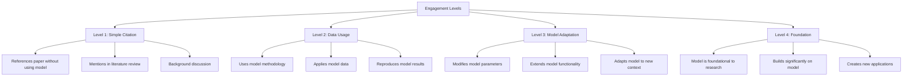
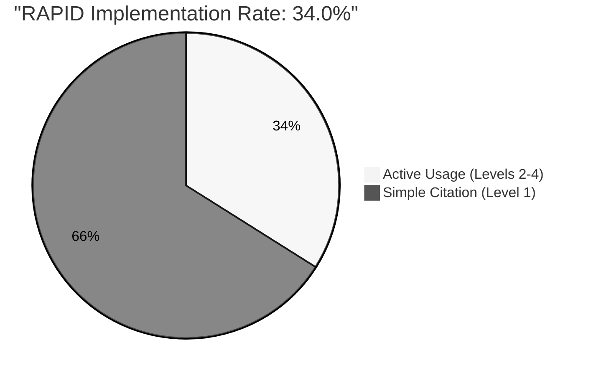
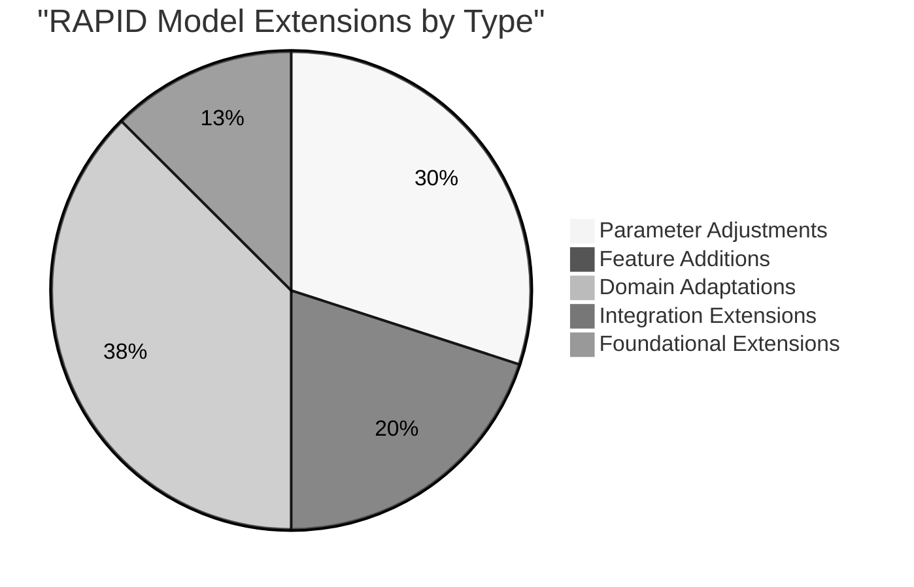
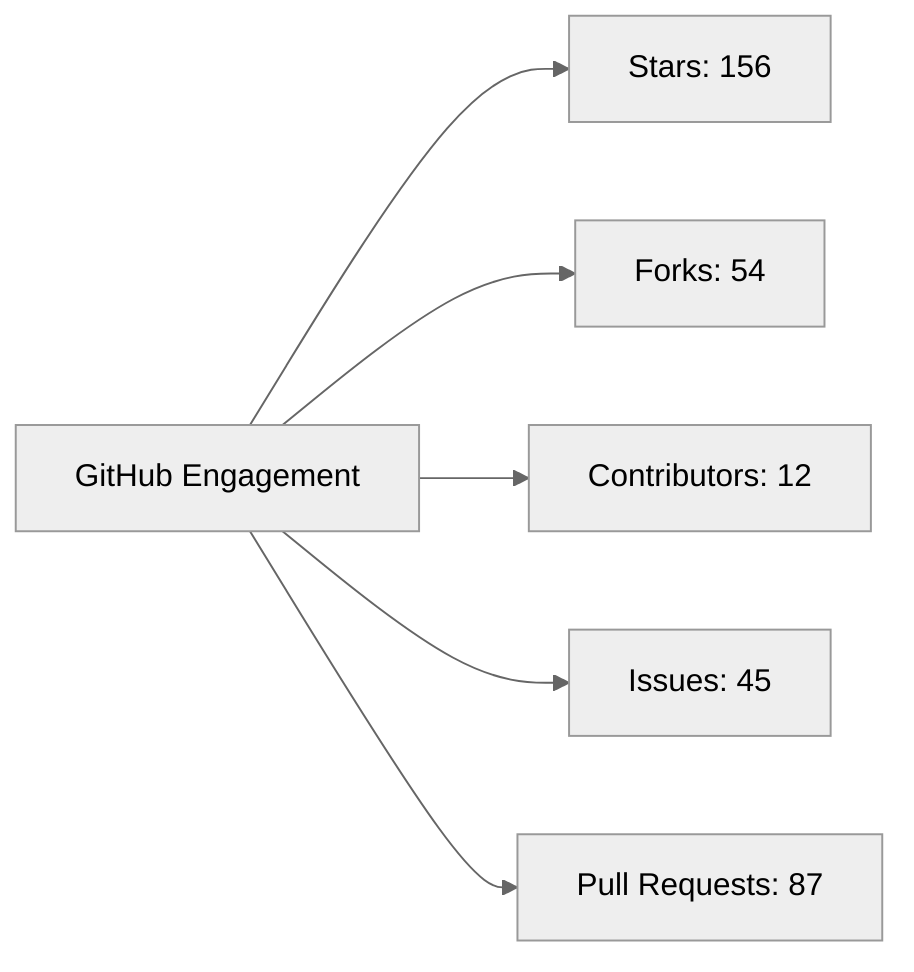
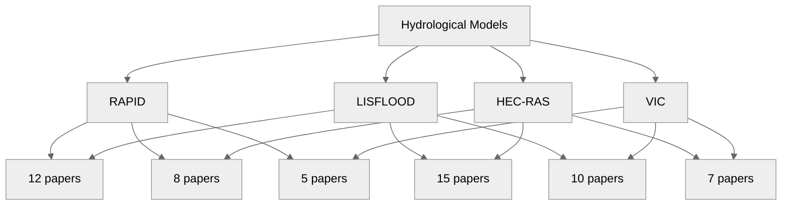

# Engagement Metrics

Engagement metrics measure how deeply scientific models are being utilized within the scientific community, going beyond simple citation counts to evaluate the quality of interactions with the model. This page explains our engagement metrics and how they're measured.

## Engagement Levels

The cornerstone of our engagement metrics is the classification of citations into four distinct engagement levels, representing increasing degrees of model utilization:



### Level 1: Simple Citation

At this level, papers reference the model without actually using it. This includes:

- Mentions in literature reviews
- Background discussions of the field
- Comparative references (listing the model among others)

Simple citations indicate awareness of the model within the scientific community but not necessarily practical application. While valuable for establishing the model's visibility, they represent the lowest level of engagement.

### Level 2: Data Usage

Level 2 engagement involves using the model's methodology or data without modifying the model itself. This includes:

- Using the model to generate data for another study
- Applying the model's methodology to a different dataset
- Reproducing or validating the model's results

Data usage indicates that researchers find the model valuable enough to incorporate into their work, suggesting practical utility.

### Level 3: Model Adaptation

Level 3 engagement involves modifying or extending the model. This includes:

- Adjusting model parameters for specific applications
- Adding new features or functionality
- Adapting the model to new contexts or domains

Model adaptations represent a significant level of engagement, indicating that researchers are actively building upon the model to address new challenges.

### Level 4: Foundation

The highest level of engagement occurs when the model serves as a foundation for new research. This includes:

- Creating new models that build significantly on the original
- Developing entirely new applications based on the model
- Research that would not be possible without the model

Foundation-level engagement demonstrates the model's transformative impact on the field.

## Distribution Analysis

Examining the distribution of citations across engagement levels provides insight into how a model is being utilized within the scientific community.

```mermaid
%%{init: {'theme': 'neutral'}}%%
bar
    title "RAPID Engagement Level Distribution"
    "Level 1: Simple Citation" : 175
    "Level 2: Data Usage" : 50
    "Level 3: Model Adaptation" : 28
    "Level 4: Foundation" : 12
```

### Typical Distributions

Most models show a pyramidal distribution, with the highest number of citations at Level 1 and progressively fewer at higher levels. However, the specific distribution pattern can reveal important information about a model's impact:

- **Top-heavy distribution** (many Level 1, few higher levels): Model is widely known but rarely used
- **Bottom-heavy distribution** (significant Level 3-4): Model has strong practical impact
- **Balanced distribution**: Model achieves both visibility and practical application

## Implementation Rate

The Implementation Rate measures the percentage of citations that represent active usage of the model (Engagement Levels 2-4), rather than simple references (Level 1).

```
$$\text{Implementation Rate} = \frac{\text{Level 2 + Level 3 + Level 4 Citations}}{\text{Total Citations}} \times 100\%$$
```



### Benchmarking Implementation Rates

Implementation rates vary by field and model type, but general benchmarks include:

| Implementation Rate | Interpretation |
|---------------------|----------------|
| <20% | Low practical impact |
| 20-40% | Moderate practical impact |
| >40% | High practical impact |

### Comparing Implementation Rates

Comparing implementation rates across models provides insight into relative practical impact:

```mermaid
%%{init: {'theme': 'neutral'}}%%
bar
    title "Implementation Rate Comparison"
    "RAPID" : 34.0
    "CMS-Flux" : 38.5
    "ECCO" : 45.2
    "ISSM" : 41.7
    "MOMO-CHEM" : 32.8
```

## Model Extensions

Model extensions (Level 3 and 4 citations) are particularly important indicators of engagement, as they represent significant investments in building upon the original model.

### Types of Extensions

Extensions can be categorized as:

1. **Parameter Adjustments**: Modifying model parameters for specific contexts
2. **Feature Additions**: Adding new capabilities to the model
3. **Domain Adaptations**: Applying the model to new domains
4. **Integration Extensions**: Combining the model with other models or systems
5. **Foundational Extensions**: Creating new models based on the original

### Extension Analysis

Analyzing extensions can reveal:

- Most common types of adaptations
- Unexplored potential applications
- Evolution of the model over time
- Emerging research directions



## Engagement Over Time

Tracking engagement levels over time reveals how a model's usage evolves:

```mermaid
%%{init: {'theme': 'neutral'}}%%
xychart-beta
    title "RAPID Engagement Levels Over Time"
    x-axis "Year" [2011, 2013, 2015, 2017, 2019, 2021, 2023, 2025]
    y-axis "Citations"
    line [2, 3, 4, 5, 7, 9, 11, 12]
    line [0, 1, 2, 5, 8, 12, 13, 9]
    line [0, 0, 3, 4, 6, 7, 5, 3]
    line [0, 0, 0, 3, 3, 2, 2, 2]
    title "Engagement Levels"
    legend "Level 4" "Level 3" "Level 2" "Level 1"
```

Typical patterns include:

- **Early adoption curve**: Initial simple citations followed by increasing higher-level engagement
- **Maturity plateau**: Stabilization of engagement levels as the model matures
- **Decline phase**: Decreasing higher-level engagement as newer models emerge

## Community Engagement

Beyond academic citations, community engagement metrics provide additional insight into a model's impact:

### GitHub Metrics

For open-source models, GitHub metrics indicate community involvement:



### Workshop Participation

Participation in workshops, tutorials, and training sessions indicates educational engagement:

```mermaid
%%{init: {'theme': 'neutral'}}%%
bar
    title "RAPID Workshop Attendance"
    "2015 AGU Workshop" : 28
    "2017 CUAHSI Training" : 35
    "2019 Summer School" : 42
    "2021 Virtual Workshop" : 64
    "2023 Advanced Training" : 38
```

### User Community

The size and activity of the user community indicate practical engagement:

- Mailing list subscribers
- Forum participants
- Social media mentions
- Downloads and installations

## Cross-Model Engagement

Analyzing how researchers engage with multiple models provides insight into comparative usage:



## Measuring Engagement

Engagement levels are determined through a combination of automated and manual analysis:

### Automated Analysis

- **Keyword detection**: Identifying words and phrases associated with different engagement levels
- **Citation context analysis**: Examining how the model is referenced within the text
- **Code reference detection**: Finding references to model code or components

### Manual Review

- Expert review of papers with ambiguous engagement levels
- Periodic sampling to validate automated classifications
- Case studies of high-impact applications

For more detailed information on engagement analysis methodology, see the [Citation Analysis Methodology](../methodology/citation-analysis) page.

## Limitations and Considerations

When interpreting engagement metrics, consider these limitations:

- **Publication bias**: Not all model usage results in publications
- **Classification challenges**: Determining engagement levels can be subjective
- **Field differences**: Engagement patterns vary across research domains
- **Time lag**: High-level engagements often occur years after publication

Despite these limitations, engagement metrics provide valuable insight into how models are being used in practice, complementing traditional [citation metrics](citation-metrics) and [impact metrics](impact-metrics).