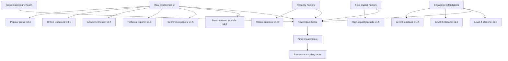
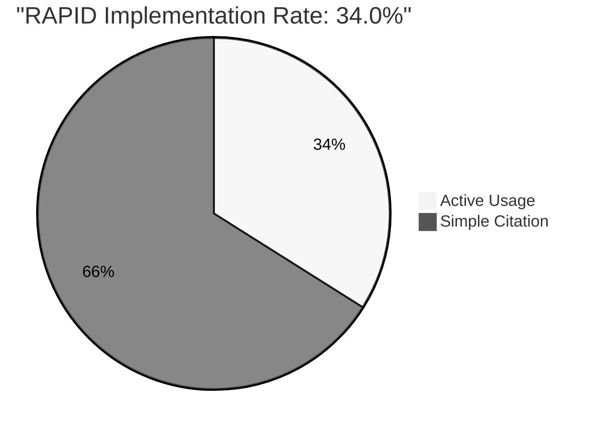
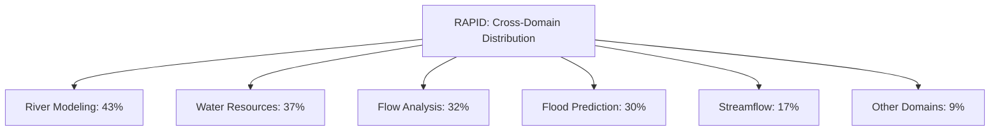
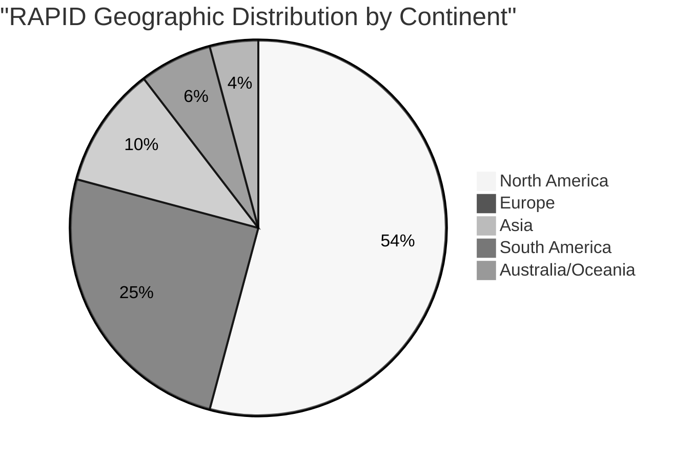

# Impact Metrics

Impact metrics go beyond simple citation counts to provide a more comprehensive understanding of a scientific model's influence and significance. This page explains the impact metrics used in the dashboard and how they are calculated.

## What are Impact Metrics?

While citation counts tell us how often a model is referenced, impact metrics help us understand the quality, depth, and breadth of a model's influence. These metrics consider factors such as:

- The quality of publications citing the model
- How deeply the model is being used in research
- The model's influence in high-impact journals
- The model's reach across different research domains
- The recency of citations

## Impact Score

The cornerstone of our impact metrics is the Impact Score, a composite metric that provides a holistic view of a model's influence. The Impact Score is calculated using a weighted formula that considers multiple factors:



### Calculation Example: RAPID Model

Here's how the Impact Score is calculated for the RAPID model:

1. **Citation Quality Component**:
   - Peer-reviewed journals (63): ×3.0 = 189.0
   - Conference papers (28): ×1.5 = 42.0
   - Technical reports (46): ×0.8 = 36.8
   - Academic theses (31): ×0.7 = 21.7
   - Online resources (92): ×0.1 = 9.2
   - Popular press (5): ×0.4 = 2.0
   - **Raw Citation Score**: 300.7

2. **Engagement Depth Multipliers**:
   - Level 4 citations (12): ×2.0 = +24.0
   - Level 3 citations (28): ×1.5 = +42.0
   - Level 2 citations (50): ×1.2 = +60.0
   - **Engagement Score**: 126.0

3. **Field Impact & Recency**:
   - High-impact journals: ×1.5 = +14.2
   - Recent citations (2 years): ×1.3 = +23.9
   - **Additional Impact**: 38.1

4. **Raw Total**: 464.8

5. **Final Impact Score**: 464.8 ÷ 30 = 15.5 (rounded to 15.5)

The scaling factor (30 in this case) is calibrated to produce scores on a 0-30 scale, where:
- 0-10: Low impact
- 10-20: Medium impact
- 20-30: High impact

### Interpreting Impact Scores

Impact Scores can be used to:

- Compare models across different fields
- Track changes in a model's influence over time
- Identify models with deep implementation vs. models that are frequently cited but rarely used

## Implementation Rate

The Implementation Rate measures the percentage of citations that represent active usage of the model (Engagement Levels 2-4), rather than simple references (Level 1).

```
$$\text{Implementation Rate} = \frac{\text{Level 2 + Level 3 + Level 4 Citations}}{\text{Total Citations}} \times 100\%$$
```

A high Implementation Rate indicates that a model is being actively used, adapted, and extended, rather than just mentioned in passing.

### Example: RAPID Model



For RAPID:
- Level 2, 3, and 4 Citations: 90
- Total Citations: 265
- Implementation Rate: 90 ÷ 265 × 100% = 34.0%

## Field Influence Factor

The Field Influence Factor measures a model's relative impact within its specific research domain. It is calculated by comparing the model's citation rate to the average citation rate for papers in the same field and time period.

$$\text{Field Influence Factor} = \frac{\text{Model's Citations Per Year}}{\text{Field Average Citations Per Year}}$$

A Field Influence Factor greater than 1.0 indicates above-average impact within the field.

### Example: Model Comparison

```mermaid
%%{init: {'theme': 'neutral', 'themeVariables': { 'primaryColor': '#1976d2', 'primaryTextColor': '#fff' }}}%%
xychart-beta
    title "Field Influence Factor Comparison"
    x-axis "Field Influence Factor" 0 --> 2
    y-axis [0.5, 1.0, 1.5, 2.0]
    bar [1.8, 1.2, 1.5, 0.9, 1.3]
    title "Models" 
    legend "ECCO" "RAPID" "ISSM" "MOMO-CHEM" "CMS-Flux"
```

## Cross-Domain Impact

The Cross-Domain Impact metric measures how broadly a model is being applied across different research domains. It is calculated based on the number of distinct research fields where the model is cited and the distribution of citations across these fields.

A high Cross-Domain Impact indicates that a model has broad applicability beyond its original intended domain.

### Shannon Diversity Index

We use a modified Shannon Diversity Index to quantify cross-domain impact:

$$H' = -\sum_{i=1}^{R} p_i \ln(p_i)$$

Where:
- $R$ is the number of research domains
- $p_i$ is the proportion of citations in domain $i$

Higher values indicate more even distribution across domains (greater cross-domain impact).

### Example: Domain Distribution



## Geographic Reach

Geographic Reach measures how widely a model is being applied geographically. It considers:

- Number of countries with implementations
- Number of continents covered
- Number of specific geographic areas (watersheds, ocean regions, etc.)

### Example: RAPID Geographic Reach



## Comparative Impact Assessment

The Comparative Impact Assessment compares a model's metrics to similar models in the same field, providing context for understanding its relative performance.

Key comparison metrics include:

- Citation count relative to model age
- Impact Score
- Implementation Rate
- Field Influence Factor
- Cross-Domain Impact
- Geographic Reach

### Example: Model Comparison

```mermaid
%%{init: {'theme': 'neutral'}}%%
xychart-beta
    title "Citations per Year Since Publication"
    x-axis "Model Age (Years)"
    y-axis "Citations/Year" 0 --> 35
    line [18.5, 20.8, 16.2, 19.7, 22.3]
    title "Models" 
    legend "RAPID (2011)" "LISFLOOD (2007)" "TOPMODEL (1995)" "HEC-RAS (2002)" "VIC (1994)"
```

## GitHub Metrics

For open-source models, GitHub metrics provide additional insight into community engagement and development activity. Key GitHub metrics include:

- Stars: Indicator of general interest
- Forks: Shows how many developers have copied the repository to modify it
- Contributors: Number of individuals contributing to the codebase
- Commits: Frequency and volume of updates
- Issues: Community engagement through problem reporting and feature requests

### Example: RAPID GitHub Metrics

```mermaid
%%{init: {'theme': 'neutral'}}%%
bar
    title "RAPID GitHub Metrics"
    "Stars" : 156
    "Forks" : 54
    "Contributors" : 12
    "Open Issues" : 45
    "Releases" : 8
```

## Limitations and Considerations

When interpreting impact metrics, it's important to consider several limitations:

- **Age Bias**: Older models have had more time to accumulate citations
- **Field Differences**: Citation practices vary significantly across research fields
- **Publication Access**: Open-access models may have higher citation rates
- **Implementation Complexity**: More complex models may have lower implementation rates despite high quality
- **Data Availability**: Models with readily available datasets may see higher usage

For a more comprehensive understanding, impact metrics should be considered alongside [citation metrics](citation-metrics) and [engagement metrics](engagement-metrics).