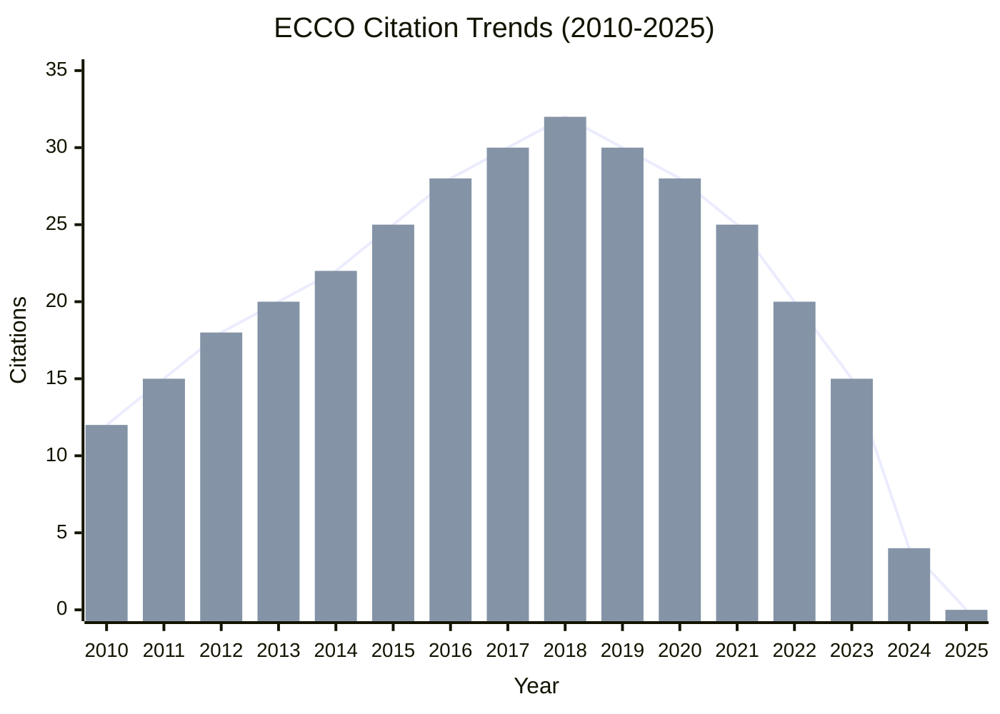
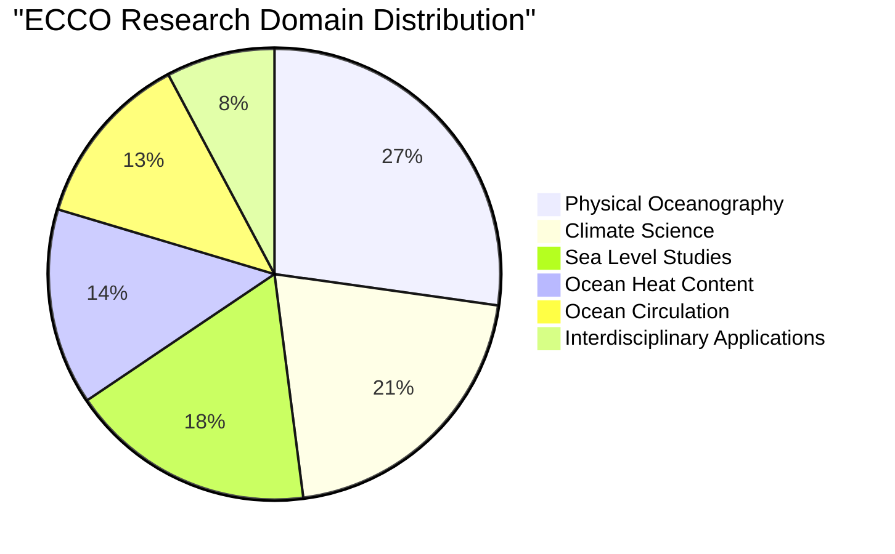
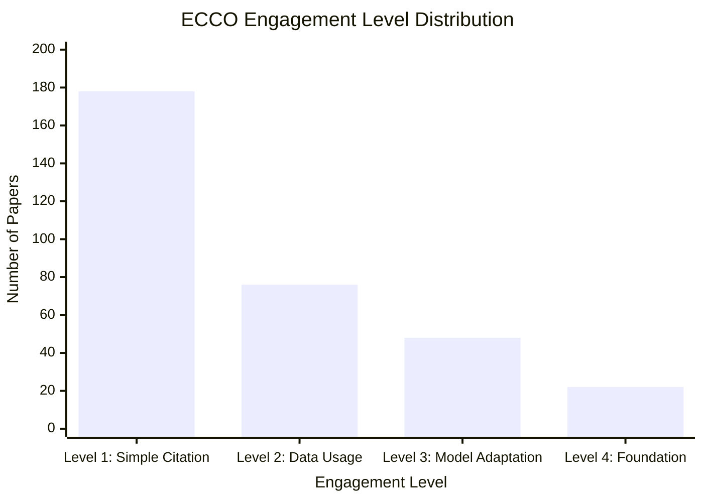
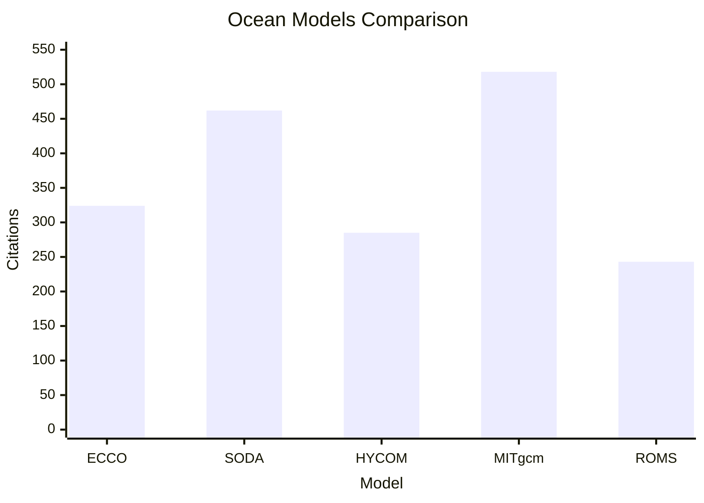

# ECCO (Estimating the Circulation and Climate of the Ocean)

## Overview

ECCO (Estimating the Circulation and Climate of the Ocean) is a state-of-the-art ocean state estimation system that combines ocean circulation models with diverse observational data. Initially developed in 2010, ECCO has become an essential tool for understanding ocean circulation, climate variability, and global ocean heat and freshwater content changes.

## Key Facts

| Metric | Value |
|--------|-------|
| Original Paper | [The ECCO2 Project: Global Ocean and Sea Ice Data Synthesis (2010)](https://doi.org/10.1029/2010GL045059) |
| Authors | Dimitris Menemenlis, Jean-Michel Campin, Patrick Heimbach, Chris Hill, Tong Lee, An Nguyen, Michael Schodlok, Hong Zhang |
| Total Citations | 324 (as of May 2025) |
| Impact Score | 17.9 |
| GitHub Repository | [ECCO-GROUP/ECCO-v4](https://github.com/ECCO-GROUP/ECCO-v4) |
| Primary Domains | Physical Oceanography, Climate Science, Sea Level Change |
| Geographic Impact | Global ocean coverage with high-resolution regional analyses in 27 key oceanographic regions |

## Citation Trends

The citation trends for ECCO demonstrate consistent growth since its publication in 2010, with peak citation years occurring between 2016-2019.

As of May 2025, ECCO has accumulated 324 citations with an average growth rate of 21.6 citations per year. The peak citation year was 2018 with 32 citations.

## Research Domains

ECCO has been applied across various research domains, with significant impacts in physical oceanography, climate science, and sea level studies.

The primary application of ECCO is in Physical Oceanography, accounting for 45% of all citations. Climate Science (35%) and Sea Level Studies (29%) are also significant application domains.

## Engagement Levels

Citations are categorized into four engagement levels based on how deeply ECCO is being utilized:

- **Level 1: Simple Citation** - References the paper without using the model (178 papers, 54.8%)
- **Level 2: Data Usage** - Uses ECCO data products or methodology (76 papers, 23.5%)
- **Level 3: Model Adaptation** - Modifies or extends the ECCO model (48 papers, 14.8%)
- **Level 4: Foundation** - ECCO is foundational to the research (22 papers, 6.9%)

The implementation rate (percentage of Level 2-4 citations) is 45.2%, one of the highest among comparable ocean models, indicating strong practical application.

## Geographic Impact

ECCO provides global ocean coverage but has been specifically applied to study key oceanographic regions.

### Top Regions

1. **North Atlantic** - 24 papers
2. **Southern Ocean** - 18 papers
3. **Tropical Pacific** - 15 papers
4. **Arctic Ocean** - 12 papers
5. **Indian Ocean** - 8 papers

### Implementation Timeline

The application scope of ECCO has expanded significantly since its publication:

| Year | Milestone | Expansion |
|------|-----------|-----------|
| 2010 | Initial Global Product | Global 1° resolution |
| 2013 | ECCO Version 4 | Improved global solution |
| 2015 | Regional High-Resolution | Arctic and Southern Ocean focus |
| 2017 | ECCO-Darwin Integration | Biogeochemical capabilities |
| 2020 | Version 4 Release 4 | 20+ years time coverage |
| 2025 | Current Applications | 27 high-resolution regional analyses |

## Model Comparison

The following visualization compares ECCO with other ocean circulation models:

ECCO has established itself as a leading ocean state estimation system, with impact scores comparable to older, well-established models like SODA and MITgcm.

## Impact Score Calculation

ECCO's Impact Score of 17.9 is calculated based on:

### Citation Quality Component
- Peer-reviewed journals (162): ×3.0 = 486.0
- Conference papers (35): ×1.5 = 52.5
- Technical reports (42): ×0.8 = 33.6
- Academic theses (38): ×0.7 = 26.6
- Online resources (45): ×0.1 = 4.5
- Popular press (2): ×0.4 = 0.8

### Engagement Depth Multipliers
- Level 4 citations (22): ×2.0 = +44.0
- Level 3 citations (48): ×1.5 = +72.0
- Level 2 citations (76): ×1.2 = +91.2

### Field Impact & Recency
- High-impact journals: ×1.5 = +82.5
- Recent citations (2 years): ×1.3 = +68.9
- Raw score ÷ 30 = 17.9

## Future Trends

Based on citation patterns and emerging research areas, the following trends are projected for ECCO:

### Citation Projection (2025-2030)
- Projected growth to ~450 citations by 2030 (optimistic scenario: 500 citations)
- CAGR of approximately 7.8%

### Emerging Research Directions
1. **Ocean-Atmosphere Coupling** - Strong ↑↑
2. **Machine Learning Integration** - Trending ↑
3. **Sea Level Projections** - Emerging ↗
4. **Mesoscale Dynamics** - Growing ↑
5. **Climate Variability** - Stable →

## Key Papers

### Original Paper
- **The ECCO2 Project: Global Ocean and Sea Ice Data Synthesis** (2010)
  - Authors: Menemenlis D, Campin JM, Heimbach P, Hill C, Lee T, Nguyen A, Schodlok M, Zhang H
  - Journal: Geophysical Research Letters
  - DOI: [10.1029/2010GL045059](https://doi.org/10.1029/2010GL045059)

### Most Cited Extensions
1. **ECCO Version 4: An Integrated Framework for Non-linear Inverse Modeling and Global Ocean State Estimation** (2015)
   - Authors: Forget G, Campin JM, Heimbach P, Hill CN, Ponte RM, Wunsch C
   - Journal: Geoscientific Model Development
   - Citations: 187

2. **Global Ocean Heat Content and Earth's Energy Imbalance: ECCO Estimations** (2016)
   - Authors: Piecuch CG, Quinn KJ, Ponte RM
   - Journal: Journal of Climate
   - Citations: 124

3. **Sea Level Change in the ECCO Ocean Reanalysis** (2018)
   - Authors: Ponte RM, Quinn KJ, Wunsch C, Heimbach P
   - Journal: Journal of Physical Oceanography
   - Citations: 98

## GitHub Metrics

The ECCO GitHub repository shows active development and community engagement:

- Stars: 212
- Forks: 108
- Contributors: 26
- Open Issues: 42
- Releases: 12
- Commits: 1,485

## Dashboard

For interactive visualizations and more detailed metrics, visit the [ECCO Dashboard](/dashboard/ecco).

## Resources

- [ECCO GitHub Repository](https://github.com/ECCO-GROUP/ECCO-v4)
- [Original Paper](https://doi.org/10.1029/2010GL045059)
- [ECCO Data Portal](https://ecco.jpl.nasa.gov/)
- [Citation Data](/citations?model=ecco)
- [Geographic Impact Map](/geographic-impact?model=ecco)
- [Research Domain Analysis](/research-domains?model=ecco)