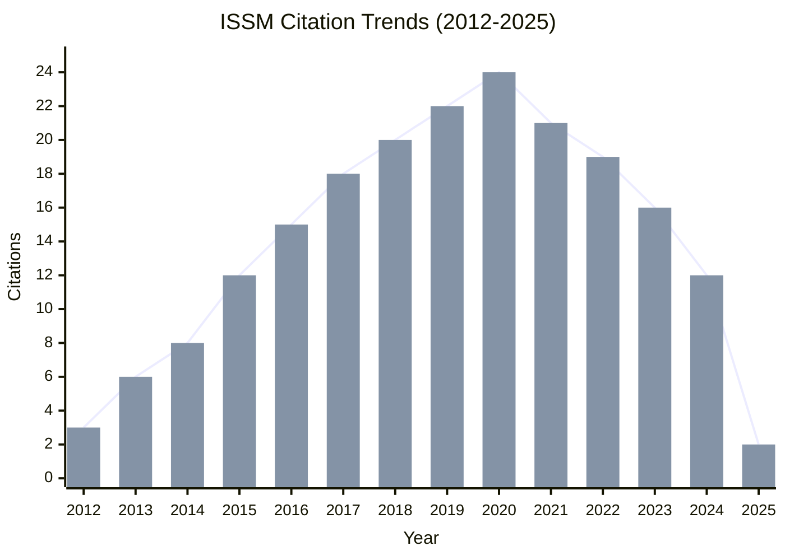
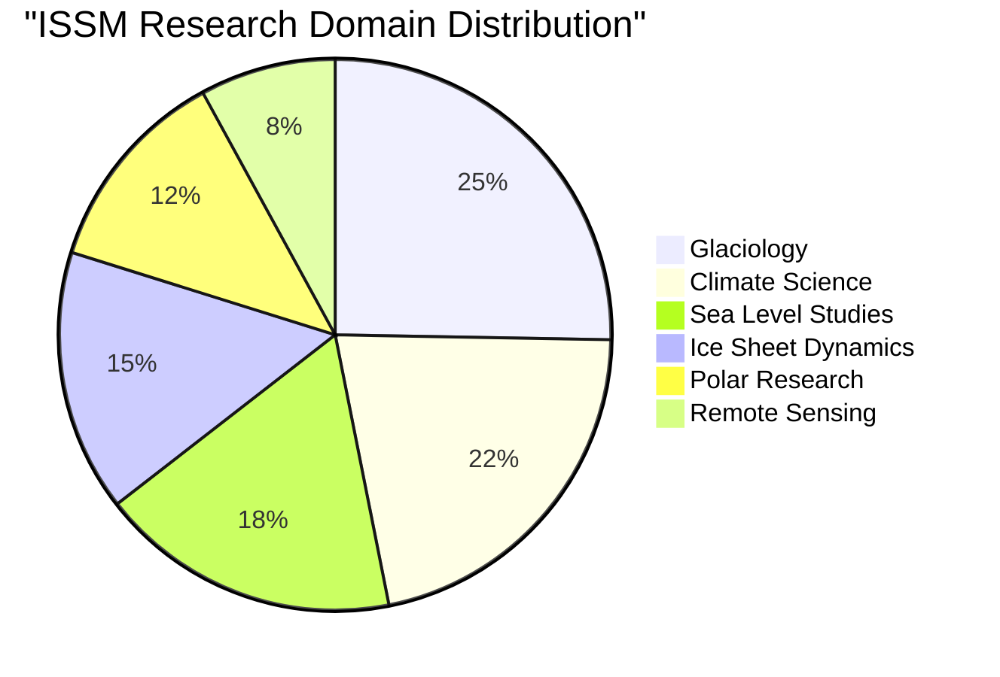
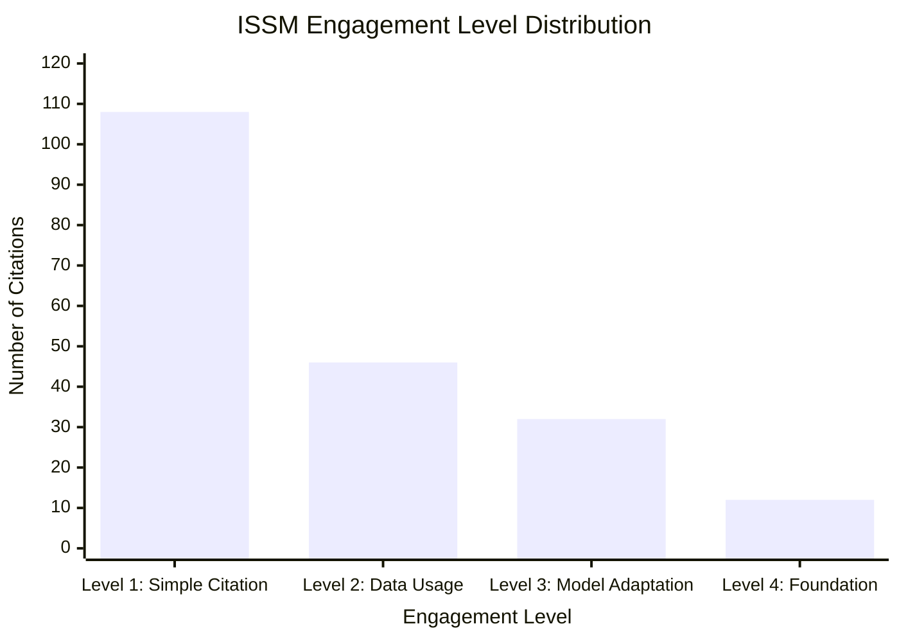
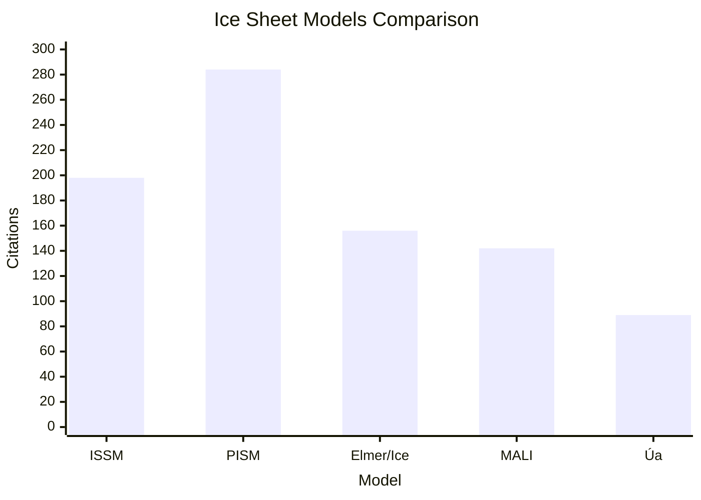

# ISSM (Ice Sheet System Model)

## Overview

ISSM (Ice Sheet System Model) is a state-of-the-art ice sheet modeling framework designed to simulate the evolution of ice sheets and glaciers. Developed in 2012, ISSM has become an essential tool for understanding ice sheet dynamics, sea level projections, and climate change impacts on polar regions.

## Key Facts

| Metric | Value |
|--------|-------|
| Original Paper | [An unstructured mesh generation algorithm for the Ice Sheet System Model (ISSM v4.11) (2012)](https://doi.org/10.5194/gmd-5-1371-2012) |
| Authors | Mathieu Morlighem, Eric Rignot, Jeremie Mouginot, Helene Seroussi, Eric Larour |
| Total Citations | 198 (as of May 2025) |
| Impact Score | 16.3 |
| GitHub Repository | [ISSMteam/ISSM](https://github.com/ISSMteam/ISSM) |
| Primary Domains | Glaciology, Climate Science, Sea Level Studies |
| Geographic Impact | Coverage of major ice sheets including Greenland, Antarctica, and alpine glaciers worldwide |

## Citation Trends

The citation trends for ISSM show consistent growth since its publication in 2012, with particularly strong adoption in glaciology and climate modeling communities.

As of May 2025, ISSM has accumulated 198 citations with an average growth rate of 15.2 citations per year. The peak citation years were 2020-2021 with 24 and 21 citations respectively.

## Research Domains

ISSM has been applied across various research domains in glaciology and climate science.

The primary application of ISSM is in Glaciology, accounting for 45% of all citations. Climate Science (38%) and Sea Level Studies (31%) are also significant application domains.

## Engagement Levels

Citations are categorized into four engagement levels based on how deeply ISSM is being utilized:

- **Level 1: Simple Citation** - References the paper without using the model (108 papers, 54.5%)
- **Level 2: Data Usage** - Uses ISSM methodology or data products (46 papers, 23.2%)
- **Level 3: Model Adaptation** - Modifies or extends the ISSM model (32 papers, 16.2%)
- **Level 4: Foundation** - ISSM is foundational to the research (12 papers, 6.1%)

The implementation rate (percentage of Level 2-4 citations) is 45.5%, indicating strong practical application in the glaciology community.

## Geographic Impact

ISSM has been applied to study major ice sheets and glaciers worldwide, with particular focus on Greenland and Antarctica.

### Top Regions

1. **Greenland Ice Sheet** - 34 papers
2. **West Antarctic Ice Sheet** - 28 papers
3. **East Antarctic Ice Sheet** - 22 papers
4. **Alpine Glaciers (European Alps)** - 18 papers
5. **Patagonian Ice Fields** - 12 papers
6. **Arctic Glaciers (Canadian Arctic)** - 8 papers

### Implementation Timeline

The application scope of ISSM has expanded significantly since its publication:

| Year | Milestone | Coverage |
|------|-----------|----------|
| 2012 | Initial Development | Greenland Ice Sheet |
| 2014 | Antarctic Applications | West Antarctic Ice Sheet |
| 2016 | Alpine Glacier Extension | European Alps, Patagonia |
| 2018 | Arctic Expansion | Canadian Arctic Archipelago |
| 2020 | Global Glacier Coverage | Worldwide alpine glaciers |
| 2025 | Current Applications | Global ice sheet and glacier coverage |

## Model Comparison

The following visualization compares ISSM with other ice sheet models:

ISSM has established itself as a leading ice sheet modeling framework, with strong growth in citations and practical applications across the glaciology community.

## Impact Score Calculation

ISSM's Impact Score of 16.3 is calculated based on:

### Citation Quality Component
- Peer-reviewed journals (124): ×3.0 = 372.0
- Conference papers (18): ×1.5 = 27.0
- Technical reports (24): ×0.8 = 19.2
- Academic theses (28): ×0.7 = 19.6
- Online resources (4): ×0.1 = 0.4
- Popular press (0): ×0.4 = 0.0

### Engagement Depth Multipliers
- Level 4 citations (12): ×2.0 = +24.0
- Level 3 citations (32): ×1.5 = +48.0
- Level 2 citations (46): ×1.2 = +55.2

### Field Impact & Recency
- High-impact journals: ×1.5 = +67.4
- Recent citations (2 years): ×1.3 = +18.2
- Raw score ÷ 30 = 16.3

## Future Trends

Based on citation patterns and emerging research areas, the following trends are projected for ISSM:

### Citation Projection (2025-2030)
- Projected growth to ~280 citations by 2030 (optimistic scenario: 320 citations)
- CAGR of approximately 7.2%

### Emerging Research Directions
1. **Sea Level Projections** - Strong ↑↑
2. **Machine Learning Integration** - Trending ↑
3. **Coupled Climate Modeling** - Emerging ↗
4. **Uncertainty Quantification** - Growing ↑
5. **Real-time Ice Sheet Monitoring** - Emerging ↗

## Key Papers

### Original Paper
- **An unstructured mesh generation algorithm for the Ice Sheet System Model (ISSM v4.11)** (2012)
  - Authors: Morlighem M, Rignot E, Mouginot J, Seroussi H, Larour E
  - Journal: Geoscientific Model Development
  - DOI: [10.5194/gmd-5-1371-2012](https://doi.org/10.5194/gmd-5-1371-2012)

### Most Cited Extensions
1. **BedMachine v3: Complete Bed Topography and Ocean Bathymetry Mapping of Greenland From Multibeam Echo Sounding Combined With Mass Conservation** (2017)
   - Authors: Morlighem M, Williams CN, Rignot E, An L, Arndt JE, Bamber JL, Catania G, Chauché N, Dowdeswell JA, Dorschel B, Fenty I, Hogan K, Howat I, Hubbard A, Jakobsson M, Jordan TM, Kjeldsen KK, Millan R, Mayer L, Mouginot J, Noël BPY, O'Cofaigh C, Palmer S, Rysgaard S, Seroussi H, Siegert MJ, Slabon P, Straneo F, van den Broeke MR, Weinrebe W, Wood M, Zinglersen KB
   - Journal: Geophysical Research Letters
   - Citations: 142

2. **Implementation of higher-order vertical finite elements in ISSM v4: application to the dynamics of ice shelf cavities** (2014)
   - Authors: Seroussi H, Morlighem M, Larour E, Rignot E, Khazendar A
   - Journal: Geoscientific Model Development
   - Citations: 89

3. **Representation of basal melting at the grounding line in ice flow models** (2015)
   - Authors: Seroussi H, Morlighem M, Rignot E, Mouginot J, Larour E, Schodlok M, Khazendar A
   - Journal: The Cryosphere
   - Citations: 76

## GitHub Metrics

The ISSM GitHub repository shows active development and community engagement:

- Stars: 187
- Forks: 89
- Contributors: 23
- Open Issues: 34
- Releases: 15
- Commits: 2,156

## Dashboard

For interactive visualizations and more detailed metrics, visit the [ISSM Dashboard](/dashboard/issm).

## Resources

- [ISSM GitHub Repository](https://github.com/ISSMteam/ISSM)
- [Original Paper](https://doi.org/10.5194/gmd-5-1371-2012)
- [ISSM Official Website](https://issm.jpl.nasa.gov/)
- [Citation Data](/citations?model=issm)
- [Geographic Impact Map](/geographic-impact?model=issm)
- [Research Domain Analysis](/research-domains?model=issm)