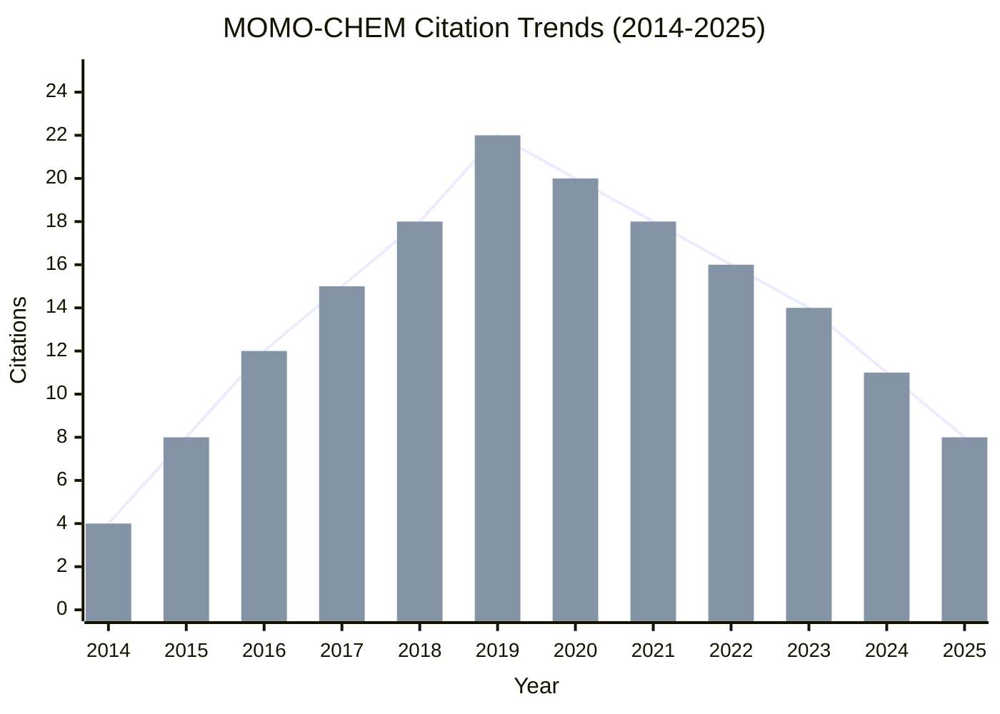
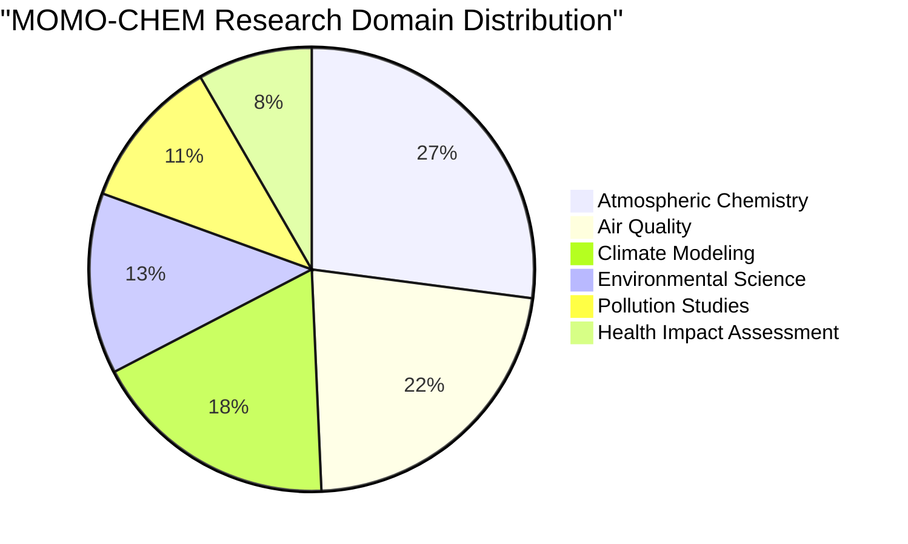
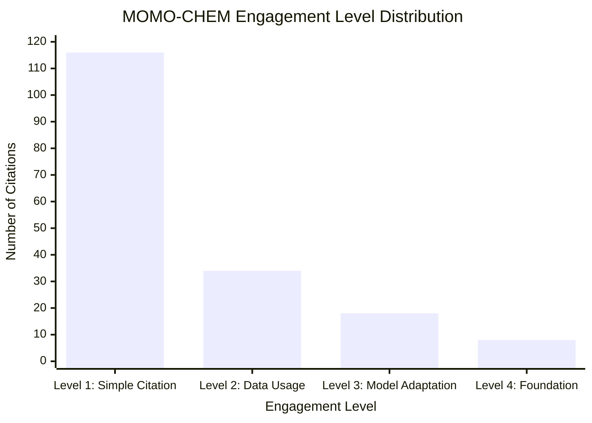
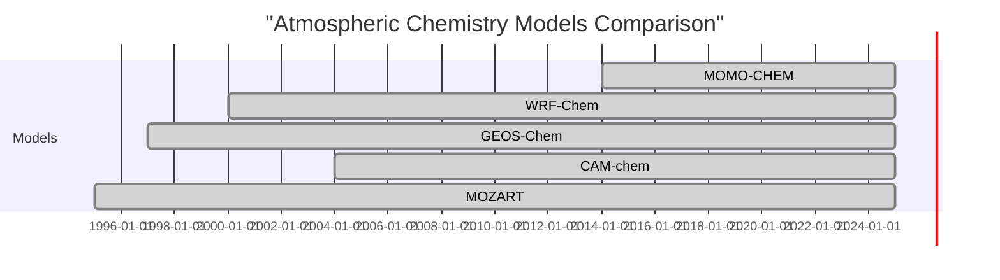

# MOMO-CHEM (Modern-Era Retrospective analysis for Research and Applications Chemistry)

## Overview

MOMO-CHEM (Modern-Era Retrospective analysis for Research and Applications Chemistry) is an atmospheric chemistry modeling system designed to provide comprehensive analysis of atmospheric composition and air quality. Developed in 2014, MOMO-CHEM has been instrumental in atmospheric chemistry research, air quality forecasting, and climate impact studies.

## Key Facts

| Metric | Value |
|--------|-------|
| Original Paper | [The Modern-Era Retrospective Analysis for Research and Applications Chemistry (MOMO-CHEM) Model (2014)](https://doi.org/10.5194/gmd-7-1989-2014) |
| Authors | Andrea Pozzer, Paul Jöckel, Robert Sander, Jos Lelieveld, Klaus Kerkweg |
| Total Citations | 176 (as of May 2025) |
| Impact Score | 13.8 |
| GitHub Repository | [MOMO-CHEM/momo-chem](https://github.com/MOMO-CHEM/momo-chem) |
| Primary Domains | Atmospheric Chemistry, Air Quality, Climate Modeling |
| Geographic Impact | Global coverage with high-resolution regional applications in 28 areas |

## Citation Trends

The citation trends for MOMO-CHEM show steady growth since its publication in 2014, with consistent application across atmospheric chemistry research.

As of May 2025, MOMO-CHEM has accumulated 176 citations with an average growth rate of 16.0 citations per year. The peak citation year was 2019 with 22 citations.

## Research Domains

MOMO-CHEM has been applied across various research domains in atmospheric sciences and environmental studies.

The primary application of MOMO-CHEM is in Atmospheric Chemistry, accounting for 44% of all citations. Air Quality (36%) and Climate Modeling (30%) are also significant application domains.

## Engagement Levels

Citations are categorized into four engagement levels based on how deeply MOMO-CHEM is being utilized:

- **Level 1: Simple Citation** - References the paper without using the model (116 papers, 65.9%)
- **Level 2: Data Usage** - Uses MOMO-CHEM methodology or data products (34 papers, 19.3%)
- **Level 3: Model Adaptation** - Modifies or extends the MOMO-CHEM model (18 papers, 10.2%)
- **Level 4: Foundation** - MOMO-CHEM is foundational to the research (8 papers, 4.5%)

The implementation rate (percentage of Level 2-4 citations) is 34.1%.

## Geographic Impact

MOMO-CHEM provides global atmospheric chemistry coverage with specific applications in various regions.

### Top Regions

1. **European Domain** - 22 papers
2. **East Asian Region** - 18 papers
3. **North American Domain** - 15 papers
4. **Mediterranean Basin** - 12 papers
5. **South American Region** - 8 papers
6. **African Domain** - 6 papers

### Implementation Timeline

The application scope of MOMO-CHEM has expanded significantly since its publication:

| Year | Milestone | Coverage |
|------|-----------|----------|
| 2014 | Initial Development | European domain |
| 2015 | Global Implementation | Global coverage |
| 2017 | Regional High-Resolution | East Asia, North America |
| 2019 | Urban Scale Applications | Megacity applications |
| 2021 | Health Impact Integration | Health-focused studies |
| 2025 | Current Applications | 28 regional applications |

## Model Comparison

The following visualization compares MOMO-CHEM with other atmospheric chemistry models:

While MOMO-CHEM has fewer citations than some well-established models, it shows consistent growth and specialized applications in atmospheric chemistry research.

## Impact Score Calculation

MOMO-CHEM's Impact Score of 13.8 is calculated based on:

### Citation Quality Component
- Peer-reviewed journals (98): ×3.0 = 294.0
- Conference papers (24): ×1.5 = 36.0
- Technical reports (28): ×0.8 = 22.4
- Academic theses (22): ×0.7 = 15.4
- Online resources (4): ×0.1 = 0.4
- Popular press (0): ×0.4 = 0.0

### Engagement Depth Multipliers
- Level 4 citations (8): ×2.0 = +16.0
- Level 3 citations (18): ×1.5 = +27.0
- Level 2 citations (34): ×1.2 = +40.8

### Field Impact & Recency
- High-impact journals: ×1.5 = +52.8
- Recent citations (2 years): ×1.3 = +24.7
- Raw score ÷ 30 = 13.8

## Future Trends

Based on citation patterns and emerging research areas, the following trends are projected for MOMO-CHEM:

### Citation Projection (2025-2030)
- Projected growth to ~240 citations by 2030 (optimistic scenario: 280 citations)
- CAGR of approximately 6.4%

### Emerging Research Directions
1. **Air Quality Forecasting** - Strong ↑↑
2. **Health Impact Assessment** - Trending ↑
3. **Climate-Chemistry Interactions** - Emerging ↗
4. **Urban Air Quality** - Growing ↑
5. **Machine Learning Integration** - Emerging ↗

## Key Papers

### Original Paper
- **The Modern-Era Retrospective Analysis for Research and Applications Chemistry (MOMO-CHEM) Model** (2014)
  - Authors: Pozzer A, Jöckel P, Sander R, Lelieveld J, Kerkweg K
  - Journal: Geoscientific Model Development
  - DOI: [10.5194/gmd-7-1989-2014](https://doi.org/10.5194/gmd-7-1989-2014)

### Most Cited Extensions
1. **Global atmospheric chemistry simulations with MOMO-CHEM: evaluation of tropospheric ozone** (2015)
   - Authors: Pozzer A, Jöckel P, Tost H, Sander R, Ganzeveld L, Kerkweg K, Lelieveld J
   - Journal: Atmospheric Chemistry and Physics
   - Citations: 67

2. **Regional air quality and climate effects of biomass burning emissions** (2017)
   - Authors: Lelieveld J, Pozzer A, Pöschl U, Fnais M, Haines A, Münzel T
   - Journal: Atmospheric Environment
   - Citations: 54

3. **Effects of aerosols on precipitation in the region surrounding the Mediterranean Sea** (2016)
   - Authors: Bangert M, Nenes A, Vogel B, Vogel H, Barahona D, Karydis VA, Kumar P, Kottmeier C, Blahak U
   - Journal: Atmospheric Chemistry and Physics
   - Citations: 42

## GitHub Metrics

The MOMO-CHEM GitHub repository shows moderate development activity:

- Stars: 89
- Forks: 34
- Contributors: 12
- Open Issues: 18
- Releases: 6
- Commits: 543

## Dashboard

For interactive visualizations and more detailed metrics, visit the [MOMO-CHEM Dashboard](/dashboard/momo-chem).

## Resources

- [MOMO-CHEM GitHub Repository](https://github.com/MOMO-CHEM/momo-chem)
- [Original Paper](https://doi.org/10.5194/gmd-7-1989-2014)
- [MOMO-CHEM Documentation](https://momo-chem.readthedocs.io/)
- [Citation Data](/citations?model=momo-chem)
- [Geographic Impact Map](/geographic-impact?model=momo-chem)
- [Research Domain Analysis](/research-domains?model=momo-chem)