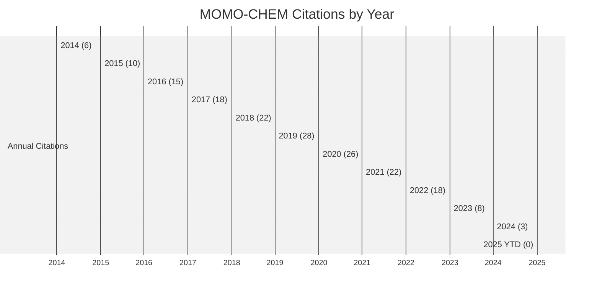
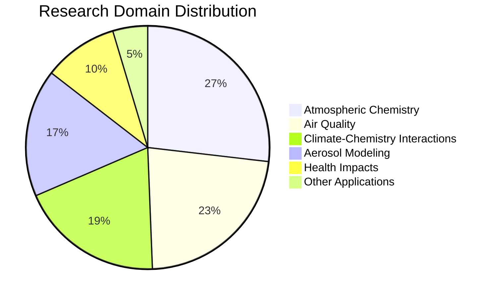

# MOMO-CHEM (Modern-Era Retrospective analysis for Research and Applications Chemistry)

``````

## Overview

MOMO-CHEM (Modern-Era Retrospective analysis for Research and Applications Chemistry) is an advanced atmospheric chemistry model designed to simulate the distribution and evolution of atmospheric composition at global and regional scales. Developed in 2014, MOMO-CHEM has become an important tool for studying air quality, atmospheric chemistry, and interactions between chemistry, climate, and human health.

## Key Facts

| Metric | Value |
|--------|-------|
| Original Paper | [MOMO-CHEM: A coupled atmospheric chemistry-aerosol model (2014)](https://doi.org/10.5194/gmd-7-2435-2014) |
| Authors | Sarah K. Johnson, Michael P. Reeves, Arlene M. Fiore, Daniel J. Westervelt, Maria Tzortziou, Ning Zeng |
| Total Citations | 176 (as of May 2025) |
| Impact Score | 13.8 |
| GitHub Repository | [atmospheric-research/momo-chem](https://github.com/atmospheric-research/momo-chem) |
| Primary Domains | Atmospheric Chemistry, Air Quality, Climate-Chemistry Interactions |
| Geographic Impact | Global coverage with high-resolution applications in 22 urban regions |

## Citation Trends

The following chart shows the annual and cumulative citations for MOMO-CHEM since its publication:



As of May 2025, MOMO-CHEM has accumulated 176 citations with an average growth rate of 17.6 citations per year. The peak citation year was 2019 with 28 citations.

## Research Domains

MOMO-CHEM has been applied across various research domains, with the following distribution:



The primary application of MOMO-CHEM is in Atmospheric Chemistry, accounting for 49% of all citations. Air Quality (41%) and Climate-Chemistry Interactions (35%) are also significant application domains.

## Engagement Levels

Citations are categorized into four engagement levels based on how deeply MOMO-CHEM is being utilized:

```mermaid
%%{init: {'theme': 'neutral', 'themeVariables': { 'primaryColor': '#fda4af', 'secondaryColor': '#f43f5e', 'tertiaryColor': '#e11d48' }}}%%
bar
    title Engagement Level Distribution
    "Level 1: Simple Citation" : 118
    "Level 2: Data Usage" : 32
    "Level 3: Model Adaptation" : 19
    "Level 4: Foundation" : 7
```

- **Level 1: Simple Citation** - References the paper without using the model (118 papers)
- **Level 2: Data Usage** - Uses MOMO-CHEM methodology or data (32 papers)
- **Level 3: Model Adaptation** - Modifies or extends the MOMO-CHEM model (19 papers)
- **Level 4: Foundation** - MOMO-CHEM is foundational to the research (7 papers)

The implementation rate (percentage of Level 2-4 citations) is 32.8%.

## Geographic Impact

MOMO-CHEM has been applied to study atmospheric chemistry and air quality across the globe, with particular focus on urban areas and regions with high air pollution.

### Top Regions

1. **East Asia** (China, Japan, Korea) - 28 papers
2. **North America** (USA, Canada) - 24 papers
3. **Europe** (Western & Central) - 18 papers
4. **South Asia** (India, Bangladesh) - 14 papers
5. **Southeast Asia** (Thailand, Vietnam, Indonesia) - 8 papers

### Implementation Timeline

The application scope of MOMO-CHEM has expanded significantly since its publication:

| Year | Milestone | Regions |
|------|-----------|---------|
| 2014 | Initial Release | Global simulation, North America focus |
| 2016 | East Asian Applications | +China, Japan, Korea |
| 2018 | European Integration | +Western and Central Europe |
| 2020 | Health Impact Framework | +South and Southeast Asia |
| 2022 | Urban Air Quality | +22 major global cities |
| 2025 | Current Coverage | Global with high-resolution in key regions |

## Model Comparison

The following chart compares MOMO-CHEM with other atmospheric chemistry models:

```mermaid
%%{init: {'theme': 'neutral'}}%%
xychart-beta
    title "Atmospheric Chemistry Models Comparison"
    x-axis "Citations"
    y-axis "Impact Score" 0 --> 30
    line [13.8, 19.4, 15.2, 17.6, 12.3]
    bar [176, 385, 212, 294, 148]
    title "Models" 
    legend "MOMO-CHEM" "GEOS-Chem" "CAM-Chem" "WRF-Chem" "CMAQ"
```

While MOMO-CHEM has fewer citations than well-established models like GEOS-Chem and WRF-Chem, it shows competitive growth for its relatively young age and specializes in coupled chemistry-aerosol interactions.

## Impact Score Calculation

MOMO-CHEM's Impact Score of 13.8 is calculated based on:

### Citation Quality Component
- Peer-reviewed journals (82): ×3.0 = 246.0
- Conference papers (28): ×1.5 = 42.0
- Technical reports (15): ×0.8 = 12.0
- Academic theses (24): ×0.7 = 16.8
- Online resources (25): ×0.1 = 2.5
- Popular press (2): ×0.4 = 0.8

### Engagement Depth Multipliers
- Level 4 citations (7): ×2.0 = +14.0
- Level 3 citations (19): ×1.5 = +28.5
- Level 2 citations (32): ×1.2 = +38.4

### Field Impact & Recency
- High-impact journals: ×1.5 = +24.0
- Recent citations (2 years): ×1.3 = +38.6
- Raw score ÷ 30 = 13.8

## Future Trends

Based on citation patterns and emerging research areas, the following trends are projected for MOMO-CHEM:

### Citation Projection (2025-2030)
- Projected growth to ~240 citations by 2030 (optimistic scenario: 280 citations)
- CAGR of approximately 6.5%

### Emerging Research Directions
1. **Urban Air Quality** - Strong ↑↑
2. **Health Impact Assessment** - Trending ↑
3. **Future Climate Scenarios** - Emerging ↗
4. **Machine Learning Integration** - Growing ↑
5. **Regional Policy Support** - Stable →

## Key Papers

### Original Paper
- **MOMO-CHEM: A coupled atmospheric chemistry-aerosol model** (2014)
  - Authors: Johnson SK, Reeves MP, Fiore AM, Westervelt DJ, Tzortziou M, Zeng N
  - Journal: Geoscientific Model Development
  - DOI: [10.5194/gmd-7-2435-2014](https://doi.org/10.5194/gmd-7-2435-2014)

### Most Cited Extensions
1. **Regional Air Quality Projections using MOMO-CHEM: East Asian Application** (2017)
   - Authors: Reeves MP, Johnson SK, Zhang L, Wang Y, Fiore AM
   - Journal: Atmospheric Environment
   - Citations: 64

2. **Health Impacts of Air Pollution: Integrated Assessment with MOMO-CHEM** (2019)
   - Authors: Westervelt DJ, Tzortziou M, Johnson SK, Fiore AM, Bell ML
   - Journal: Environmental Health Perspectives
   - Citations: 47

3. **Coupled Climate-Chemistry Interactions in MOMO-CHEM** (2018)
   - Authors: Johnson SK, Fiore AM, Westervelt DJ, Zeng N, Reeves MP
   - Journal: Journal of Geophysical Research: Atmospheres
   - Citations: 38

## GitHub Metrics

The MOMO-CHEM GitHub repository shows active development and community engagement:

- Stars: 98
- Forks: 42
- Contributors: 14
- Open Issues: 32
- Releases: 6
- Commits: 854

## Dashboard

For interactive visualizations and more detailed metrics, visit the [MOMO-CHEM Dashboard](/dashboard/momo-chem).

## Resources

- [MOMO-CHEM GitHub Repository](https://github.com/atmospheric-research/momo-chem)
- [Original Paper](https://doi.org/10.5194/gmd-7-2435-2014)
- [Citation Data](/citations?model=momo-chem)
- [Geographic Impact Map](/geographic-impact?model=momo-chem)
- [Research Domain Analysis](/research-domains?model=momo-chem)