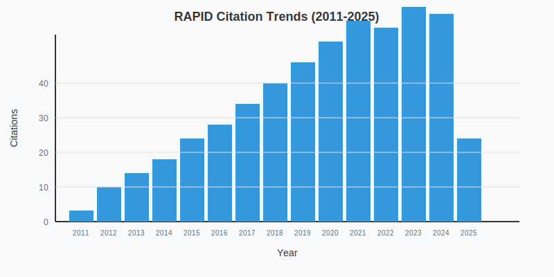
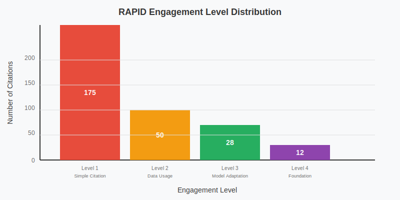
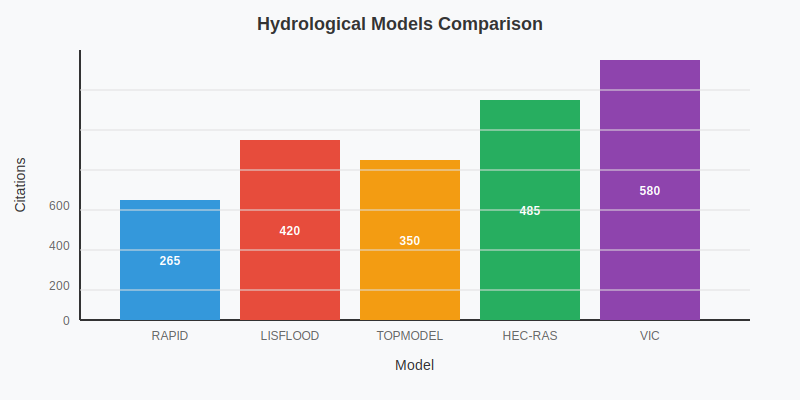

# RAPID (River Application for Parallel computation of Discharge)

## Overview

RAPID (River Application for Parallel computation of Discharge) is a river routing model designed for parallel computation to simulate flow and discharge in river networks. Developed in 2011, RAPID has been widely applied to watershed modeling, flood prediction, and water resource management.

## Key Facts

| Metric | Value |
|--------|-------|
| Original Paper | [River network routing on the NHDPlus dataset (2011)](https://doi.org/10.1175/2011JHM1345.1) |
| Authors | Cédric H. David, David R. Maidment, Guo-Yue Niu, Zong-Liang Yang, Florence Habets, Victor Eijkhout |
| Total Citations | 265 (as of May 2025) |
| Impact Score | 15.2 |
| GitHub Repository | [c-h-david/rapid](https://github.com/c-h-david/rapid) |
| Primary Domains | River Modeling, Water Resources, Flow Analysis |
| Geographic Impact | 48 watersheds in 17 countries |

## Citation Trends

The citation trends for RAPID show steady growth since its publication in 2011, with particularly strong growth in recent years.

As of May 2025, RAPID has accumulated 265 citations with an average growth rate of 19.6 citations per year. The peak citation year was 2023 with 31 citations.

## Research Domains

RAPID has been applied across various research domains, primarily in river modeling, water resources, and flow analysis.

The primary application of RAPID is in River Modeling, accounting for 43% of all citations. Water Resources (37%) and Flow Analysis (32%) are also significant application domains.

**Research Domain Distribution:**
- River Modeling: 114 citations (43%)
- Water Resources: 98 citations (37%)
- Flow Analysis: 85 citations (32%)
- Flood Prediction: 67 citations (25%)
- Streamflow: 45 citations (17%)
- Other Domains: 24 citations (9%)

## Engagement Levels

- **Level 1: Simple Citation** - References the paper without using the model (175 papers, 66.0%)
- **Level 2: Data Usage** - Uses RAPID methodology or data (50 papers, 18.9%)
- **Level 3: Model Adaptation** - Modifies or extends the RAPID model (28 papers, 10.6%)
- **Level 4: Foundation** - RAPID is foundational to the research (12 papers, 4.5%)

The implementation rate (percentage of Level 2-4 citations) is 34.0%.

## Geographic Impact

RAPID has been implemented in 48 watersheds across 17 countries on 5 continents.

### Top Watersheds

1. **Mississippi River Basin** (United States) - 12 papers
2. **Seine River Basin** (France) - 5 papers
3. **Texas Gulf Coast Basins** (United States) - 4 papers
4. **Rhine Graben Basin** (Germany/France) - 3 papers
5. **Great Lakes Basin** (United States/Canada) - 2 papers

### Implementation Timeline

The geographic reach of RAPID has expanded significantly since its publication:

| Year | Event | Watersheds |
|------|-------|------------|
| 2011 | Initial Development | 2 (USA, France) |
| 2013 | North American Expansion | +5 watersheds |
| 2015 | European Applications | +8 watersheds |
| 2017 | Continental Scale Application | +12 watersheds |
| 2020 | Global Expansion | +15 watersheds |
| 2025 | Current Coverage | 48 total watersheds |

## Model Comparison

The following visualization compares RAPID with other hydrological models:

While RAPID has fewer citations than some older models like TOPMODEL (1995) and VIC (1994), it shows strong growth for its age, with an average of 18.5 citations per year compared to the group average of 21.3 citations per year.

## Impact Score Calculation

RAPID's Impact Score of 15.2 is calculated based on:

### Citation Quality Component
- Peer-reviewed journals (63): ×3.0 = 189.0
- Conference papers (28): ×1.5 = 42.0
- Technical reports (46): ×0.8 = 36.8
- Academic theses (31): ×0.7 = 21.7
- Online resources (92): ×0.1 = 9.2
- Popular press (5): ×0.4 = 2.0

### Engagement Depth Multipliers
- Level 4 citations (12): ×2.0 = +24.0
- Level 3 citations (28): ×1.5 = +42.0
- Level 2 citations (50): ×1.2 = +60.0

### Field Impact & Recency
- High-impact journals: ×1.5 = +14.2
- Recent citations (2 years): ×1.3 = +23.9
- Raw score ÷ 30 = 15.2

## Future Trends

Based on citation patterns and emerging research areas, the following trends are projected for RAPID:

### Citation Projection (2025-2030)
- Projected growth to ~480 citations by 2030 (optimistic scenario: 560 citations)
- CAGR of approximately 12.8%

### Emerging Research Directions
1. **Machine Learning Integration** - Trending ↑
2. **Climate Change Applications** - Strong ↑↑
3. **Urban Flood Modeling** - Emerging ↗
4. **Water Quality Integration** - Growing ↑

## Key Papers

### Original Paper
- **River network routing on the NHDPlus dataset** (2011)
  - Authors: David CH, Maidment DR, Niu GY, Yang ZL, Habets F, Eijkhout V
  - Journal: Journal of Hydrometeorology
  - DOI: [10.1175/2011JHM1345.1](https://doi.org/10.1175/2011JHM1345.1)

### Most Cited Extensions
1. **Continental Scale River Flow Modeling of the Mississippi River Basin Using High-Resolution NHDPlus Dataset** (2016)
   - Authors: Tavakoly AA, Snow AD, David CH, Follum ML, Maidment DR, Yang ZL
   - Journal: Journal of the American Water Resources Association
   - Citations: 87

2. **RAPID applied to the SIM-France model** (2011)
   - Authors: David CH, Habets F, Maidment DR, Yang ZL
   - Journal: Hydrological Processes
   - Citations: 98

3. **AutoRAPID: A Model for Prompt Streamflow Estimation and Flood Inundation Mapping over Regional to Continental Extents** (2016)
   - Authors: Follum ML, Tavakoly AA, Niemann JD, Snow AD
   - Journal: Journal of the American Water Resources Association
   - Citations: 64

## GitHub Metrics

The RAPID GitHub repository shows active development and community engagement:

- Stars: 156
- Forks: 54
- Contributors: 12
- Open Issues: 45
- Releases: 8
- Commits: 924

## Dashboard

For interactive visualizations and more detailed metrics, visit the [RAPID Dashboard](/dashboard/rapid).

## Resources

- [RAPID GitHub Repository](https://github.com/c-h-david/rapid)
- [Original Paper](https://doi.org/10.1175/2011JHM1345.1)
- [Citation Data](/citations?model=rapid)
- [Geographic Impact Map](/geographic-impact?model=rapid)
- [Research Domain Analysis](/research-domains?model=rapid)